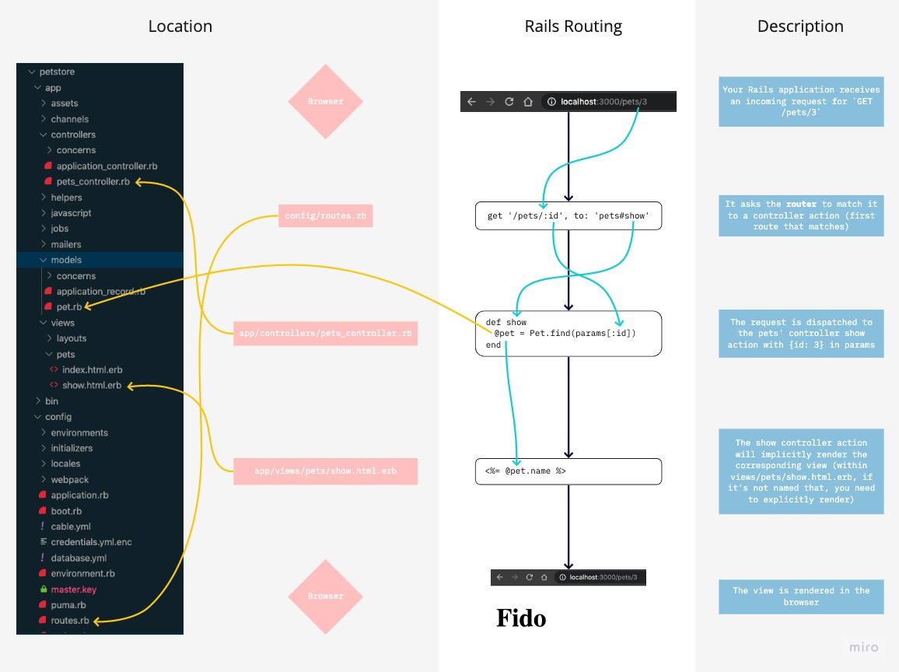

# Intro to Rails

## Objectives

- What is MVC
- What is REST
- What is CRUD
- The Scaffold Generator
- Rails File/Folder Structure
- Building Out a Rails App "Manually"
- Implicit vs Explicit Routing
- Rails Routing

## What is MCV?

MVC stands for Model, View, Controller.

MVC is an architectural programming pattern, or a way to structure your application. It is a popular pattern (although by far not the only one) which essentially separates your application out into 3 main components, Models, Views, and Controllers.

Some of the benefits of using the MVC pattern are, that we are able to separate our concerns and are making our code easier to read and use for other developers. It also takes the guess work out of where to put certain files and what to name them.

### Model = Data

The Model represents the data of your application. It interacts with your database, is essentially the main logic behind your application and should not depend on your controller or view.

### View = Interface

Views display data through our controllers, and should be built independently of models and controllers. Views are what the end user actually sees.

### Controller = Go-Between

The controller is where everything comes together, it provides model data to your views and deals with information that comes back from the user (e.g. in the form of a button press). - The controller pretty much does all the work and is dependent on the model and the view.

## What is REST?

REST stands for Representational State Transfer.
REST is a design pattern (or convention) providing standards between systems and is often used when designing APIs.

### Benefits

- Standards (consistency) make it easier for systems (and developers) to communicate with each other
- REST methods minimize URLs, maximize functionality

### "Rules"

- We use 4 HTTP verbs, GET, POST, PATCH, DELETE
- RESTful routes depend on the HTTP verb and the URL
- Many of the CRUD actions are different actions that occur on the same resource
- HTTP requests are stateless
- URLs represent the state of our data
  - https://api.github.com/users
  - https://api.github.com/users/dhh


## What is CRUD?

CRUD stands for Create, Read, Update, Delete


## Intro: What is Rails

Rails was created in 2003 by David Heinemeier Hansson, while working on the code base for Basecamp, a project management tool by 37signals. David extracted Ruby on Rails and officially released it as open source code in July of 2004. Despite rapid iteration of the Rails code base throughout the years, it has stuck to three basic principles:

- Ruby Programming Language
- Model-View-Controller Architecture
- Programmer Happiness

Rails was created with the goal of increasing programmers' happiness and productivity levels. In short, with Rails you can get started with a full-stack web application by quickly creating pages, templates and even query functions.

Rails heavily emphasizes **_"Convention over Configuration."_** This means that a programmer only needs to specify and code out the non-standard parts of a program. Even though Rails comes with its own set of tools and settings, you're certainly not limited to library of rails commands and configurations. Developers are free to configure their applications however they wish, though adopting conventions is certainly recommended.


### A Look Back

As we look back at the history of Rails, let's review some of the more significant releases over the years.

- Rails 1.0 (Dec 2005) - Mostly polishing up and closing pending tickets from the first release along with the inclusion of Scriptaculous 1.5 and Prototype 1.4.
- Rails 1.2 (Jan 2007) - REST and generation HTTP appreciation
- Rails 2.0 (Dec 2007) - Better routing resources, multi-view, HTTP basic authentication, cookie store sessions
- Rails 2.0 (Nov 2008) - i18n, thread safe, connection pool, Ruby 1.9, JRuby
- Rails 2.3 (Mar 2009) - Templates, Engines, Rack
- Rails 3.0 (Aug 2010) - New query engine, new router for controller, mailer controller, CRSF protection
- Rails 3.1 (Aug 2011) - jQuery, SASS, CoffeeScript, Sprockets with Assets Pipeline
- Rails 3.2 (Jan 2012) - Journey routing engine, faster development mode, automatic query explains, tagged loggin for multi-user application
- Rails 4.0 (June 2013) - Rails 4.2: Active Job, Asynchronous Mails, Adequate Record, Web Console, Foreign Keys.
- Rails 5.0 (June 2016) - Notable additions in Rails 5.0 include an option for an API-only application suitable for use as a backend to JavaScript or mobile applications. Also Action Cable for live features such as chat and notifications.

Over the years, Rails has indeed made it easier for beginners to dive into web development and build large complex applications. Some popular websites built on Rails include Twitter (at one point), GitHub and, of course, 37signals' very own Basecamp. Although it has often been criticized for performance and bloat, Rails continues its iterations with an ever-growing developer community and a vibrant ecosystem.

[Built With Rails](https://skillcrush.com/2015/02/02/37-rails-sites/)

### Let's install rails, if you haven't already :)

```bash
gem install rails
```

Versions of Rails change quite rapidly, and if you leave off the "-v", you'll just get the latest version. Be specific if you want a specific version.

```bash
gem install rails -v=INSERT_RAILS_VERSION_HERE
```

## Demo: _dinosaurs!_

_Editor's note: the code in this repo doesn't match the walkthroughs and examples below, but rather is the result of coding during the corresponding lecture. Also, there have been some updates and comments sprinkled in here and there. In addition, `rails g resource caveman` was run, so check out the result. It's a little more than we want -- with .coffee and .scss files, but it does give us the model, controller, migration, views folder, and CRUD routes we want. Have a look at `dinosaurs/new.html.erb`. Examples are given for three ways to build the same form!!! Feel free to fork and clone to build out the missing functionality here._

On the command of the parent directory where you want your app to go:

```ruby
rails new dinosaurs
cd dinosaurs
rails generate resource dinosaur name number_of_teeth:integer etc. (we can add --no-test-framework)
```

Let's look at the contents of this folder (using `ls`), and take a look at the files and folders that were magically created by the `rails new` command:

```
├── app
├── bin
├── config
├── db
├── lib
├── log
├── public
├── test
├── tmp
└── vendor
```

Some details about this structure:

- 90% of the web app code will be inside the folder `app`, including all of our model, view, and controller logic.
- `config` contains all the credentials for the DB and other 3rd party services, all the deployment settings, and the specs about how to serve this app over HTTP.
- `db` will contain all of your migrations

We will describe the other folders in later lessons, and for the next couple of weeks, you will primarily write code inside the folders described above.

```ruby
rails db:migrate # <-- this might be `rake db:migrate` if you're using <= rails v. 4.2
rails server
```

Now we'll head over to `localhost:3000/dinosaurs`. All of our REST actions are live!
We didn't use a resource generator in lecture, but it provides us with a model, migration, controller, and routes. It does not populate the controller actions for us, though. We also get some auto-generated .coffee and .scss files as well, which we likely won't use, at least for now. So we can delete those.

Rails follow a pattern called **"convention over configuration"** - this means that by default, a Rails app expects you to follow specific patterns and folder structures. This means you need to learn these conventions, but also means that once you learn them, you save time by not having to setup a lot of the configuration you'd otherwise need to set up manually.

This structure may look a bit complex – there a lot of files, specific naming conventions, and some nested files and folders. We generally don't create this structure manually, but instead use the Rails command line tool, which initializes the app for us:

> **Note:** By default, if you _do not_ add any option for the database, Rails will create the app with SQLite3. While you are working in a local development environment (localhost), you won't notice much of a difference between SQLite3 and PostgreSQL.

> Once your app is in production on a remote server, you will _not_ use SQLite, and they will often use PostgreSQL. A best practice in web development is to keep development and production environments as similar as possible, so we recommend using PostgreSQL from the start.

### Rails Routing

As you know, a "route" is a combination of **the path** that was requested and **the HTTP verb** that was used to request that path.

```
                                          -----> Model <----> DB
                                         |         |
            response        request      |         |
   Browser <-------- router -------> controller <--
                             GET         ^
                             PUT         |
                             POST         -----> view <----> html/images/css/js
                             DELETE
```

Rails has a "routing engine" that separates the routing logic from the controller logic (what we want to happen when routes are requested). The configuration for this routing engine is in the file `config/routes.rb`.

```ruby
Rails.application.routes.draw do

end
```

Everything between the `do` and the `end` will be code related to handling routes for the current application.



### Generate a controller

As Rails is an MVC framework, we will need to have controllers to handle requests and call the database through models.

In Rails, the controllers are files inside the folder `app/controllers`. If you open this folder, you will see that one controller is already here: the file `application_controller.rb`. This controller does not directly handle HTTP requests, but rather serves as a link between all the controllers we will create, `application_controller.rb` will be the parent of all the controllers in our app.

There is 3 different ways for creating a controller in Rails:

1. We can manually create a file and write the ruby code inside it.
2. We can use a generator called `controller`, using `rails g controller CONTROLLER_NAME [ACTIONS]`. For instance, if we want to create a controller for the resource `dinosaurs` with an action and a view for `index` and `show`, we would type in the console `rails g controller dinosaurs index show`. This command would create a bunch of files and modify some others:

   - The controller itself, `dinosaurs_controller.rb` inside `app/controllers`
   - The views for each method , in this case
     - `app/views/index.html.erb`
     - `app/views/show.html.erb`
   - The routes handlers for these two actions will also be added to config/routes.rb :
     - `get '/dinosaurs/index', to: 'dinosaurs#index'`
     - `get '/dinosaurs/show', to: 'dinosaurs#show'`

3. We can use the `scaffold_controller` generator. This generator will create the same files as the previous generator but with a REST logic for views, controller and views.

### Create methods for a RESTful controller

We've already defined what a RESTful resource is, let's see how to implement it in a rails app.

As a reminder, a RESTful resource will include 7 methods:

- Index
- Show
- New
- Create
- Edit
- Update
- Delete

Rails has a generator called `scaffold` that will create the whole MVC structure for a resource, let's say that inside the dinosaurs app, we want the `Dinosaur` resource to have a name and a number_of_teeth field, we would type:

```ruby
rails g scaffold Dinosaur name number_of_teeth:integer # remember that if we don't specify data type, it defaults to string
```

Running this command will generate a lot of files, including the controller, the views, the model, and the migration. It will also update the routes file.

Take a look at the controller, it has all the RESTful methods, and these methods already contain the code to query the database through the model `Dinosaur`.

We don't want all the files created with the scaffold and in practice you won't actually use it so let's delete it

```ruby
rails d scaffold Dinosaur
```

Let's go ahead and generate a new Dinosaurs controller.

### Create Views

There is no specific generator that will create only a view file, but you can add them manually into the appropriate folder inside views.

For instance, if we want to add a view file `about` for the resource `Dinosaur`, we can create a file `about.html.erb` in `app/views/dinosaurs`.

If a view is "static" - as in, it doesn't use any instance variables created in the controller - you can just create a route for this view and rails will render it in the browser even if there is no method in the controller:

In config/routes.rb

```ruby
get "/dinosaurs/about", to: 'dinosaurs#about'
```

If there is a file `about.html.erb` in `app/views/dinosaurs`, this file will be automatically rendered when you call `localhost:3000/dinosaurs/about`

### Implicit vs Explicit Rendering

Thanks to Rails conventions, we do not need to specify the view file to render in our controller. This is known as implicit rendering

In app/controllers/dinosaurs

```ruby
  def index
  end
```

However, if we wanted to be more explicit or if we wanted to render a view template that does not correspond with the action name we could do the following:

```ruby
  def index
    render 'cats'
    # This will render cats.html.erb
  end
```

### Generate a model

Sometimes, you will need a model but not the related controller, in this case, you will use the model generator:

```
rails g model MODEL_NAME [fields]
```

This will generate the model by itself along with the migration containing all the fields and the data types if you wrote them when you typed the console.

### Generate a migration

In Rails, to create migrations, you can use a generator.

```ruby
rails g migration AddAgeToDinosaurs age:integer
```

By following certain conventions like the one above, rails will generate a migration that specifically adds the age column to your existing dinosaurs column.

```ruby
class AddAgeToDinosaur < ActiveRecord::Migration[5.1]
  def change
    add_column :dinosaurs, :age, :integer
  end
end
```

### Conclusion

Rome wasn't built in a day and neither can someone learn Rails in a day. Keep coding and it will all come together.

[Rails Guides](http://guides.rubyonrails.org/index.html)

_Content for this readme taken from work originally done by Johann Kerr_
